# 🎓 UPQ Sistema Integral - Web Scraper

> Sistema automatizado de extracción y monitoreo en tiempo real de datos académicos del Sistema Integral de la Universidad Politécnica de Querétaro.

[](https://www.python.org/downloads/)
[](LICENSE)
[](https://telegram.org/)

---

## 📋 Descripción

Sistema profesional de web scraping que proporciona acceso automatizado a la plataforma académica de la UPQ con análisis inteligente, almacenamiento persistente y notificaciones en tiempo real a través de Telegram.

## ✨ Características Principales

- 🤖 **Integración con Telegram** - Bot conversacional multi-usuario con autenticación personalizada
- 🔐 **Autenticación Multi-Usuario** - Cada usuario usa sus propias credenciales de forma segura
- 📁 **Almacenamiento Separado por Usuario** - Datos aislados para cada usuario del bot
- 🎯 **Detección Automática de ID de Inscripción** - Extracción automática del `iid` para cada usuario
- 🔔 **Detección de Cambios en Tiempo Real** - Notificaciones instantáneas de actualizaciones de calificaciones
- 💾 **Almacenamiento Persistente** - Historial completo con snapshots individuales por usuario
- ⌨️ **Interfaz de Línea de Comandos** - CLI completa para scripting y automatización
- 📊 **Análisis Académico Avanzado** - Promedio, créditos, estancias, historial y materias atrasadas
- 🏗️ **Arquitectura Modular** - Separación clara de responsabilidades, lista para integración con API REST
- 🔒 **Código Type-Safe** - Type hints completos y soporte para análisis estático

## 🚀 Instalación

### Requisitos Previos

- Python 3.8 o superior
- pip (gestor de paquetes)
- Git
- Credenciales válidas del Sistema Integral UPQ

### Instrucciones de Instalación

**1. Clonar el repositorio:**

```bash
git clone https://github.com/EmilianoLedesma/Web_Scrapping_UPQ.git
cd Web_Scrapping_UPQ
```

**2. Crear y activar entorno virtual:**

```bash
# Windows PowerShell
python -m venv venv
.\venv\Scripts\Activate.ps1

# Linux/macOS
python3 -m venv venv
source venv/bin/activate
```

**3. Instalar dependencias:**

```bash
pip install -r requirements.txt
```

**4. Configurar variables de entorno:**

```bash
cp .env.example .env
```

Edita `.env` con tus credenciales:

```env
UPQ_USERNAME=tu_matricula
UPQ_PASSWORD=tu_contraseña
TELEGRAM_BOT_TOKEN=tu_token_de_telegram  # Opcional, para el bot
```

---

## 💻 Uso

### Interfaz de Línea de Comandos

#### 📊 Obtener Calificaciones Actuales

```bash
python main.py --get-grades
```

#### 🔍 Verificar Cambios en Calificaciones

```bash
python main.py --check-new
```

#### 📈 Mostrar Estadísticas

```bash
python main.py --stats
```

#### 💾 Exportar Datos

```bash
python main.py --export backup.json
```

#### � Ver Información del Perfil

```bash
python main.py --info
```

#### 🎓 Consultar Promedio General

```bash
python main.py --promedio
```

#### 📚 Consultar Créditos

```bash
python main.py --creditos
```

#### 🏢 Consultar Estancias Profesionales

```bash
python main.py --estancias
```

#### 📈 Ver Historial de Promedios

```bash
python main.py --historial
```

#### �📄 Salida en Formato JSON

```bash
python main.py --json
```

### 🤖 Interfaz del Bot de Telegram

**Iniciar el bot:**

```bash
python run_bot.py
```

**Comandos disponibles:**

| Comando | Descripción |
|---------|-------------|
| `/start` | Inicializar el bot y registrar credenciales personales |
| `/logout` | Eliminar credenciales y cerrar sesión |
| `/grades` | Obtener y mostrar calificaciones actuales |
| `/check` | Verificar actualizaciones de calificaciones |
| `/stats` | Ver estadísticas del sistema |
| `/info` | Información del perfil académico |
| `/promedio` | Consultar promedio general |
| `/creditos` | Ver créditos cursados y restantes |
| `/estancias` | Información de estancias profesionales |
| `/historial` | Historial académico completo |
| `/materias` | Consultar materias atrasadas |
| `/help` | Mostrar ayuda de comandos |

**Características del Bot:**

- 🔐 **Autenticación Personalizada**: Cada usuario registra sus propias credenciales
- 📁 **Datos Aislados**: Almacenamiento separado por usuario
- 🎯 **Detección Automática de iid**: Extracción automática del ID de inscripción
- 💬 **Interfaz Natural**: Responde a mensajes en lenguaje natural
- 🔔 **Notificaciones**: Alertas de cambios en calificaciones

Para documentación detallada del bot, consulta [bot/README.md](bot/README.md)

---

## 🏗️ Arquitectura Técnica

### Componentes del Sistema

```text
upq-scraper/
├── 📁 config/              # Configuración y gestión de entorno
│   └── settings.py         # Cargador centralizado de configuración
├── 📁 scraper/             # Motor principal de scraping
│   ├── auth.py            # Gestión de autenticación y sesiones
│   ├── parser.py          # Parser adaptativo de HTML
│   └── fetcher.py         # Cliente HTTP con lógica de reintentos
├── 📁 storage/             # Capa de persistencia de datos
│   └── memory.py          # Almacenamiento JSON con historial
├── 📁 bot/                 # Integración con Telegram
│   └── telegram_bot.py    # Manejadores y comandos del bot
├── 📁 tests/               # Suite de pruebas
│   └── test_scraper.py    # Pruebas unitarias e integración
├── 📁 tools/               # Scripts de utilidad y exploradores
├── 📄 main.py              # Punto de entrada CLI
├── 📄 run_bot.py           # Lanzador del servicio del bot
└── 📄 requirements.txt     # Manifiesto de dependencias
```

### Flujo de Autenticación

```mermaid
graph LR
    A[Inicio] --> B[POST a alumnos.php/signin]
    B --> C[Gestión de Sesión]
    C --> D[Cookies en requests.Session]
    D --> E[Ejecución de Requests]
    E --> F{Sesión Válida?}
    F -->|Sí| G[Continuar]
    F -->|No| B
```



**Pasos:**
1. 🔑 **Login Inicial**: POST de credenciales a `alumnos.php/signin`
2. 🍪 **Gestión de Sesión**: Mantener sesión autenticada vía `requests.Session()` con cookies
3. 🔄 **Ejecución de Requests**: Todos los requests subsecuentes usan el contexto de sesión autenticada
4. ✅ **Validación de Sesión**: Detección automática y re-autenticación en caso de expiración

### Estrategia de Parsing HTML

Parsing resiliente diseñado para manejar actualizaciones de la plataforma:

- 🎯 **Identificación de Tablas basada en Contenido**: Localiza tablas analizando texto de encabezados en lugar de clases CSS
- 🗺️ **Mapeo Dinámico de Columnas**: Identifica columnas de datos mediante patrones de coincidencia de texto
- 🔍 **Patrones Regex Flexibles**: Patrones adaptativos para extraer datos estructurados
- 🔄 **Fallback Multi-nivel**: Implementa estrategias de respaldo en cascada para fallos de parsing
- ✔️ **Capa de Validación**: Validación cruzada de datos extraídos contra formatos esperados

### Algoritmo de Detección de Cambios

```python
# Pseudocódigo del algoritmo
snapshot_actual = obtener_calificaciones()
snapshot_anterior = cargar_ultimo_snapshot()

cambios = detectar_diferencias(snapshot_actual, snapshot_anterior)

for cambio in cambios:
    if cambio.tipo == "NUEVA_MATERIA":
        notificar("Nueva materia agregada")
    elif cambio.tipo == "CALIFICACION_PUBLICADA":
        notificar(f"Nueva calificación: {cambio.valor}")
    elif cambio.tipo == "CALIFICACION_MODIFICADA":
        notificar(f"Calificación actualizada: {cambio.anterior} → {cambio.nuevo}")
```

**Proceso:**
1. 📸 **Creación de Snapshot**: Generar snapshot con marca de tiempo en cada consulta
2. 🔍 **Análisis Diferencial**: Comparar estado actual con último snapshot guardado
3. 🏷️ **Clasificación de Eventos**: Categorizar cambios en:
   - ➕ Nuevas materias agregadas
   - 📝 Calificaciones publicadas (null → valor)
   - 🔄 Calificaciones modificadas (valor → nuevo valor)
4. 🔔 **Envío de Notificaciones**: Disparar alertas para cambios detectados

---

## ⚙️ Configuración

### Variables de Entorno

Configuración en archivo `.env`:

```env
# Credenciales de Autenticación
UPQ_USERNAME=tu_matricula
UPQ_PASSWORD=tu_contraseña

# Endpoints del Sistema
UPQ_BASE_URL=https://sistemaintegral.upq.edu.mx
UPQ_LOGIN_URL=https://sistemaintegral.upq.edu.mx/alumnos.php/signin
UPQ_GRADES_URL=https://sistemaintegral.upq.edu.mx/alumnos.php/carga-academica

# Configuración del Cliente HTTP
REQUEST_TIMEOUT=30
USER_AGENT=Mozilla/5.0 (Windows NT 10.0; Win64; x64) AppleWebKit/537.36

# Almacenamiento de Datos
STORAGE_PATH=storage/grades_history.json

# Integración con Telegram (Opcional)
TELEGRAM_BOT_TOKEN=tu_token_del_bot
```

---

## 🧪 Pruebas

### Ejecutar Suite de Pruebas

```bash
# Ejecutar todas las pruebas
pytest tests/

# Ejecutar con reporte de cobertura
pytest tests/ --cov=scraper --cov=storage --cov=bot

# Ejecutar archivo específico con verbosidad
pytest tests/test_scraper.py -v
```

### Cobertura de Pruebas

```bash
# Generar reporte HTML de cobertura
pytest tests/ --cov=scraper --cov-report=html

# Ver reporte en navegador
open htmlcov/index.html  # macOS/Linux
start htmlcov/index.html # Windows
```

---

## 🛠️ Guía de Desarrollo

### Puntos de Extensión

El diseño modular facilita la adición de funcionalidades:

| Módulo | Ubicación | Descripción |
|--------|-----------|-------------|
| 🕷️ **Scrapers Personalizados** | `scraper/` | Implementar nuevos parsers |
| 💾 **Formatos de Exportación** | `storage/memory.py` | Extender con serializadores adicionales |
| 🤖 **Comandos de Bot** | `bot/telegram_bot.py` | Agregar manejadores |
| 🌐 **REST API** | Crear `api/` | Nuevos endpoints HTTP |

### Sistema de Tipos

Aprovechar type hints de Python para mantenibilidad:

```python
from typing import Dict, Any, Optional, List

def parse_grades(self) -> Dict[str, Any]:
    """
    Analizar calificaciones desde respuesta HTML.
    
    Returns:
        Dict conteniendo datos estructurados de calificaciones
    """
    pass

def detect_changes(
    self, 
    current: Dict[str, Any], 
    previous: Optional[Dict[str, Any]] = None
) -> List[Dict[str, Any]]:
    """Detectar cambios entre snapshots."""
    pass
```

### Estándares de Calidad

- 📏 **Guía de Estilo**: Cumplimiento con PEP 8
- 🔍 **Type Checking**: Análisis estático con mypy
- 📝 **Documentación**: Docstrings completos
- ✅ **Testing**: Cobertura mínima del 80%
- 🎨 **Formateo**: Uso de black para consistencia

---

## 🗺️ Roadmap

### Funcionalidades Planificadas

#### Fase 1: Mejoras Inmediatas
- [ ] 🔔 **Notificaciones en Tiempo Real**: Alertas automáticas de Telegram en cambios de calificaciones
- [ ] 👥 **Soporte Multi-Cuenta**: Gestionar múltiples cuentas de estudiantes desde una interfaz
- [ ] 📊 **Dashboard Web**: Panel de visualización con Flask y gráficos interactivos

#### Fase 2: Análisis y Reportes
- [ ] 📈 **Motor de Análisis**: Análisis de tendencias de calificaciones y modelado predictivo
- [ ] 🧮 **Calculadora de Promedio**: Cálculo automático de promedio ponderado
- [ ] 📄 **Formatos de Exportación**: Reportes PDF con plantillas personalizables
- [ ] 📧 **Integración con Email**: Notificaciones configurables por correo electrónico

#### Fase 3: Plataforma Completa
- [ ] 📱 **Aplicación Móvil**: App multiplataforma con React Native
- [ ] 🌐 **API Gateway**: API RESTful para integraciones de terceros
- [ ] 🗄️ **Backend de Base de Datos**: PostgreSQL/MongoDB para almacenamiento escalable
- [ ] 🔄 **Sistema de Caché**: Redis para optimización de consultas

### Optimizaciones de Rendimiento

- [ ] ⚡ Requests HTTP asíncronos para consultas paralelas
- [ ] 💨 Capa de caché para datos frecuentemente accedidos
- [ ] 🚦 Rate limiting y pooling de requests
- [ ] ⏰ Scheduling de trabajos en background con Celery

---

## 📜 Licencia

Este proyecto está licenciado bajo la Licencia MIT. Consulta el archivo [LICENSE](LICENSE) para más detalles.

---

## ⚖️ Aviso Legal

Este software se proporciona únicamente para uso educativo y personal. Los usuarios son responsables de cumplir con los términos de servicio de la Universidad Politécnica de Querétaro y las regulaciones aplicables. Los desarrolladores no asumen responsabilidad por uso indebido o violaciones.

---

## 👨‍💻 Autor

### Emiliano Ledesma

- 🐙 GitHub: [@EmilianoLedesma](https://github.com/EmilianoLedesma)
- 💼 Proyecto: [Web_Scrapping_UPQ](https://github.com/EmilianoLedesma/Web_Scrapping_UPQ)

---

## 💬 Soporte

Para preguntas, issues o solicitudes de funcionalidades:

- 🐛 **Issues**: [GitHub Issues](https://github.com/EmilianoLedesma/Web_Scrapping_UPQ/issues)
- 💭 **Discusiones**: [GitHub Discussions](https://github.com/EmilianoLedesma/Web_Scrapping_UPQ/discussions)

---

<div align="center">

**🐍 Construido con Python** | Mantenido por Emiliano Ledesma | Licencia MIT

</div>
