# 🤖 Bot de Telegram - Sistema de Monitoreo UPQ

> Monitoreo en tiempo real de calificaciones y acceso a datos académicos a través de interfaz de Telegram para el Sistema Integral de la Universidad Politécnica de Querétaro.

[](https://www.python.org/downloads/)
[](https://github.com/python-telegram-bot/python-telegram-bot)
[](https://telegram.org/)

---

## 📝 Descripción

Bot profesional de Telegram que proporciona acceso seguro y remoto al sistema académico de la UPQ con monitoreo automatizado de calificaciones, detección de cambios y estadísticas completas.

## ✨ Características Principales

- 📊 **Acceso a Calificaciones en Tiempo Real**: Consulta instantánea a través de interfaz conversacional
- 🔍 **Detección Inteligente de Cambios**: Identificación y reporte automático de actualizaciones
- 📈 **Análisis Histórico**: Estadísticas completas y análisis de tendencias
- 🔐 **Autenticación Segura**: Comunicación encriptada de extremo a extremo con Sistema Integral UPQ
- 💬 **Comandos Intuitivos**: Estructura de comandos en lenguaje natural para facilidad de uso
- 🌐 **Disponibilidad 24/7**: Diseñado para operación continua en VPS o infraestructura cloud

---

## 🚀 Instalación

### Requisitos Previos

Asegúrate de tener todas las dependencias del proyecto instaladas:

```bash
pip install -r requirements.txt
```

Esto instalará `python-telegram-bot` (v20.7) junto con las dependencias principales del proyecto.

### Configuración del Bot

#### 🤖 Obtener Token de Telegram Bot

1. Abre Telegram y busca [@BotFather](https://t.me/botfather)
2. Envía el comando `/newbot`
3. Sigue las instrucciones interactivas
4. Copia el token API proporcionado

#### ⚙️ Configuración de Variables de Entorno

Agrega tu token del bot al archivo `.env`:

```env
TELEGRAM_BOT_TOKEN=1234567890:ABCdefGHIjklMNOpqrsTUVwxyz
UPQ_USERNAME=tu_matricula
UPQ_PASSWORD=tu_contraseña
```

### ▶️ Ejecutar el Bot

#### Windows PowerShell

```powershell
$env:PYTHONIOENCODING='utf-8'
python run_bot.py
```

#### Linux/macOS

```bash
python run_bot.py
```

El bot se inicializará y comenzará a escuchar comandos. Deberías ver:

```text
2025-11-08 19:40:00 - telegram.ext.Application - INFO - Application started
Bot is running. Press Ctrl+C to stop.
```

---

## 📱 Referencia de Comandos

### `/start` - Inicializar Bot

Inicializa la sesión del bot y muestra el mensaje de bienvenida con resumen de comandos.

**Respuesta:**

```text
🎓 Bienvenido al Bot de UPQ Sistema Integral

Comandos disponibles:
/grades - Consultar calificaciones
/check - Verificar cambios
/stats - Ver estadísticas
/help - Ayuda
```

### `/grades` - Consultar Calificaciones

Obtiene y muestra las calificaciones académicas actuales del Sistema Integral UPQ.

**Ejemplo de Respuesta:**

```text
📊 CALIFICACIONES

👤 EMILIANO LEDESMA
🎫 Matrícula: 123046244
📅 Periodo: SEPTIEMBRE-DICIEMBRE 2025
🕐 Consulta: 2025-11-08T19:40:00

─────────────────────────────────
📚 LIDERAZGO DE EQUIPOS DE ALTO DESEMPEÑO
👨‍🏫 Profesor: RAMIREZ RESENDIZ ADRIANA KARINA
🏫 Grupo: S204-7
📝 Calificaciones: P1: 9.35 | P2: 9.20 | P3: --
─────────────────────────────────
```

### `/check` - Verificar Cambios

Realiza análisis diferencial contra el último snapshot para detectar cambios.

**Respuesta (con cambios):**

```text
✅ Se detectaron 2 cambios

📚 LIDERAZGO DE EQUIPOS DE ALTO DESEMPEÑO
🔄 P2: -- → 9.20
⏰ Timestamp: 2025-11-08T19:40:00Z

📚 PROGRAMACIÓN WEB
🔄 P1: 8.5 → 9.0
⏰ Timestamp: 2025-11-08T19:40:00Z
```

**Respuesta (sin cambios):**

```text
ℹ️ No se detectaron cambios desde la última verificación.
⏰ Última consulta: 2025-11-08T19:30:00Z
```

### `/stats` - Estadísticas del Sistema

Muestra métricas completas del sistema y estadísticas de uso.

**Ejemplo de Respuesta:**

```text
📊 ESTADÍSTICAS DEL SISTEMA

📸 Total de snapshots registrados: 5
🔔 Cambios detectados: 3
⏰ Última verificación: 2025-11-08T19:40:00Z
📅 Primer snapshot: 2025-11-01T10:00:00Z
📆 Periodo de monitoreo: 7 días
```

### `/help` - Ayuda de Comandos

Muestra referencia detallada de comandos e instrucciones de uso.

---

## 🏗️ Arquitectura Técnica

### Diseño del Sistema

```text
bot/telegram_bot.py
│
├── 🤖 UPQTelegramBot (Clase Principal)
│   ├── 📋 Manejadores de Comandos
│   │   ├── start_command()      # Inicialización del bot
│   │   ├── help_command()       # Mostrar documentación
│   │   ├── grades_command()     # Consulta de calificaciones
│   │   ├── check_command()      # Detección de cambios
│   │   └── stats_command()      # Mostrar estadísticas
│   │
│   └── ⚠️ Gestión de Errores
│       └── error_handler()      # Manejo global de errores
│
└── 🔌 Integración de Módulos
    ├── config.settings          # Configuración de entorno
    ├── scraper.fetcher          # Capa de requests HTTP
    ├── scraper.parser           # Motor de parsing HTML
    ├── scraper.auth             # Gestor de autenticación
    └── storage.memory           # Capa de persistencia de datos
```

### Flujo de Ejecución

```mermaid
graph TB
    A[📱 Usuario envía mensaje] --> B[🤖 Bot recibe comando]
    B --> C[⚙️ Procesamiento de comando]
    C --> D[🔐 Autenticación con UPQ]
    D --> E[🕷️ Scraper obtiene datos]
    E --> F[📊 Parser analiza HTML]
    F --> G[💾 Guardar snapshot]
    G --> H[📝 Formatear respuesta]
    H --> I[✉️ Enviar mensaje a usuario]
```



**Pasos del proceso:**

1. 📨 **Recepción de Mensaje**: Telegram entrega mensaje del usuario al bot
2. 🔀 **Procesamiento de Comando**: Bot identifica y enruta comando al manejador apropiado
3. 🔐 **Autenticación**: Establece sesión segura con Sistema Integral UPQ
4. 🕷️ **Extracción de Datos**: Scraper obtiene y analiza datos académicos
5. 💾 **Actualización de Storage**: Guarda snapshot con marca de tiempo para detección de cambios
6. 📋 **Formateo de Respuesta**: Estructura datos en mensaje amigable para el usuario
7. ✉️ **Entrega**: Envía respuesta formateada de vuelta al usuario vía Telegram

### Estrategia de Manejo de Errores

Gestión completa de errores para garantizar confiabilidad:

| Tipo de Error | Estrategia |
|---------------|-----------|
| ❌ **Fallos de Autenticación** | Validación de credenciales con mensajes claros de error |
| 🌐 **Problemas de Red** | Lógica de reintentos con backoff exponencial |
| ⏰ **Caída del Sistema UPQ** | Detección de indisponibilidad y notificación al usuario |
| 🔄 **Expiración de Sesión** | Re-autenticación automática al detectar timeout |
| 📄 **Cambios de Formato HTML** | Degradación gradual con estrategias de parsing alternativas |
| 🚫 **Errores de API Telegram** | Manejo de rate limits e interrupciones de red |

---

## 🔒 Arquitectura de Seguridad

### Protección de Datos

| Aspecto | Implementación |
|---------|----------------|
| 🔐 **Almacenamiento de Credenciales** | Bot lee credenciales de `.env`, nunca almacena contraseñas |
| 🔒 **Encriptación de Transporte** | Todas las comunicaciones con Telegram encriptadas vía HTTPS |
| 💾 **Gestión de Sesión** | Tokens de sesión mantenidos en memoria, limpiados al apagar |
| 📝 **Logging de Errores** | Logs sanitizados que excluyen información sensible |
| 👤 **Control de Acceso** | Diseñado para operación de un solo usuario, no multi-tenant |

### Mejores Prácticas de Seguridad

- ✅ Nunca compartir el token del bot públicamente
- ✅ Restringir acceso del bot solo a usuarios autorizados
- ✅ Rotar credenciales regularmente
- ✅ Monitorear logs del bot para actividad sospechosa
- ✅ Usar variables de entorno para todos los secretos
- ⛔ No exponer el bot en repositorios públicos
- ⛔ No compartir capturas de pantalla con tokens visibles

## Deployment Options

### Production Deployment Strategies

#### Option 1: Virtual Private Server (VPS)

Recommended providers: DigitalOcean, AWS EC2, Google Cloud, Linode

**Setup Steps:**

1. Provision VPS with Ubuntu 20.04 or later
2. Install Python 3.8+ and dependencies
3. Clone repository and configure environment
4. Set up systemd service for automatic startup

#### Option 2: Process Manager (tmux/screen)

For quick deployment without service configuration:

```bash
# Create persistent tmux session
tmux new -s telegram-bot

# Start bot
python run_bot.py

# Detach from session: Ctrl+B, then D
# Reattach to session: tmux attach -t telegram-bot
```

#### Option 3: systemd Service (Linux)

**Enterprise-grade solution for production environments**

Create service file `/etc/systemd/system/upq-bot.service`:

```ini
[Unit]
Description=UPQ Sistema Integral Telegram Bot
After=network.target

[Service]
Type=simple
User=your_username
WorkingDirectory=/path/to/Web_Scrapping_UPQ
Environment="PATH=/path/to/venv/bin"
ExecStart=/path/to/venv/bin/python run_bot.py
Restart=always
RestartSec=10

[Install]
WantedBy=multi-user.target
```

**Service Management:**

```bash
# Enable service to start on boot
sudo systemctl enable upq-bot

# Start service
sudo systemctl start upq-bot

# Check service status
sudo systemctl status upq-bot

# View logs
sudo journalctl -u upq-bot -f
```

#### Option 4: Docker Container

**Containerized deployment for scalability**

Create `Dockerfile`:

```dockerfile
FROM python:3.11-slim

WORKDIR /app

COPY requirements.txt .
RUN pip install --no-cache-dir -r requirements.txt

COPY . .

CMD ["python", "run_bot.py"]
```

Build and run:

```bash
docker build -t upq-bot .
docker run -d --name upq-bot --env-file .env upq-bot
```

## Troubleshooting Guide

### Common Issues and Solutions

#### Issue: python-telegram-bot Module Not Found

**Error Message:**
```text
ModuleNotFoundError: No module named 'telegram'
```

**Solution:**
```bash
pip install python-telegram-bot==20.7
```

#### Issue: TELEGRAM_BOT_TOKEN Not Configured

**Error Message:**
```text
KeyError: 'TELEGRAM_BOT_TOKEN'
```

**Solution:**

Verify `.env` file contains:
```env
TELEGRAM_BOT_TOKEN=your_actual_token_here
```

Ensure `.env` is in project root directory.

#### Issue: Bot Not Responding to Commands

**Diagnostic Steps:**

1. **Verify Bot is Running**: Check terminal for startup confirmation
2. **Check Bot Conversation**: Ensure you've initiated conversation with `/start`
3. **Validate Token**: Confirm token matches BotFather-provided token
4. **Network Connectivity**: Test internet connection and firewall settings

#### Issue: UPQ Authentication Failures

**Error Message:**
```text
Authentication failed: Invalid credentials
```

**Solution:**

Verify credentials in `.env`:
```env
UPQ_USERNAME=your_student_id
UPQ_PASSWORD=your_actual_password
```

Test credentials by logging into UPQ web interface manually.

#### Issue: HTML Parsing Errors

**Error Message:**
```text
ParsingError: Unable to locate grades table
```

**Possible Causes:**
- UPQ system HTML structure changed
- Session expired during scraping
- Network timeout during page fetch

**Solution:**
- Check `scraper/parser.py` for updated parsing logic
- Verify UPQ system is accessible via browser
- Review error logs for specific parsing failures

## Logging and Monitoring

### Log Output

Bot generates structured logs with the following format:

```text
2025-11-08 19:40:00,123 - telegram.ext.Application - INFO - Application started
2025-11-08 19:40:05,456 - __main__ - INFO - Command /grades executed by user 123456789
2025-11-08 19:40:08,789 - scraper.auth - INFO - Authentication successful
2025-11-08 19:40:12,012 - scraper.parser - INFO - Grades parsed successfully
```

### Persistent Logging

To save logs to file:

```bash
# Redirect all output to log file
python run_bot.py 2>&1 | tee bot.log

# Or use systemd journal (if running as service)
sudo journalctl -u upq-bot -f
```

### Log Levels

Configure log verbosity in `run_bot.py`:

```python
import logging

# DEBUG: Detailed diagnostic information
logging.basicConfig(level=logging.DEBUG)

# INFO: General informational messages (default)
logging.basicConfig(level=logging.INFO)

# WARNING: Warning messages only
logging.basicConfig(level=logging.WARNING)

# ERROR: Error messages only
logging.basicConfig(level=logging.ERROR)
```

## Roadmap

### Planned Enhancements

- [ ] **Automated Push Notifications**: Scheduled grade checks with proactive alerts
- [ ] **Multi-User Support**: Secure multi-tenant architecture for group deployment
- [ ] **Admin Dashboard**: Web-based management interface for monitoring
- [ ] **Configurable Intervals**: User-defined check frequencies
- [ ] **PDF Grade Reports**: Export academic data to formatted PDF documents
- [ ] **Grade Analytics**: Trend visualization and statistical analysis
- [ ] **Custom Alerts**: Configurable notification rules and filters
- [ ] **Grade Predictions**: ML-based grade forecasting
- [ ] **Study Reminders**: Intelligent deadline tracking and notifications

### Performance Improvements

- [ ] Redis caching for faster response times
- [ ] Async request handling for concurrent users
- [ ] Database backend for scalable storage
- [ ] Rate limiting and request optimization

## Contributing

Contributions are welcome! Please follow the project's contribution guidelines in the [main README](../README.md).

## Documentation

For comprehensive documentation:

- **Project Overview**: See [Main README](../README.md)
- **Architecture Details**: Review source code in `bot/telegram_bot.py`
- **API Reference**: Check `python-telegram-bot` [documentation](https://docs.python-telegram-bot.org/)

## License

This project is licensed under the MIT License. See [LICENSE](../LICENSE) for details.

## Support

For support and questions:

- **Issues**: [GitHub Issues](https://github.com/EmilianoLedesma/Web_Scrapping_UPQ/issues)
- **Documentation**: [Project Wiki](https://github.com/EmilianoLedesma/Web_Scrapping_UPQ/wiki)
- **Discussions**: [GitHub Discussions](https://github.com/EmilianoLedesma/Web_Scrapping_UPQ/discussions)

## Author

Developed and maintained by **Emiliano Ledesma**

- GitHub: [@EmilianoLedesma](https://github.com/EmilianoLedesma)
- Project: [Web_Scrapping_UPQ](https://github.com/EmilianoLedesma/Web_Scrapping_UPQ)

---

**Part of the UPQ Sistema Integral Web Scraper Project** | [Return to Main Documentation](../README.md)
