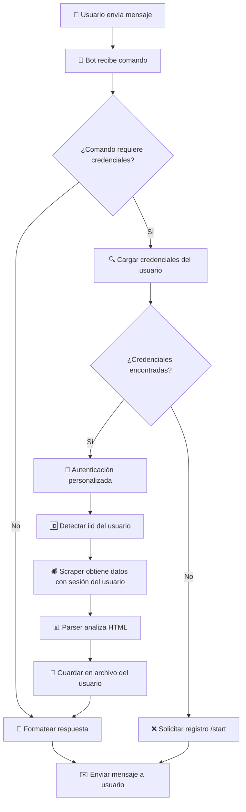

# 🤖 Bot de Telegram - Sistema de Monitoreo UPQ

> Monitoreo en tiempo real de calificaciones y acceso a datos académicos a través de interfaz de Telegram para el Sistema Integral de la Universidad Politécnica de Querétaro.

[](https://www.python.org/downloads/)
[](https://github.com/python-telegram-bot/python-telegram-bot)
[](https://telegram.org/)

---

## 📝 Descripción

Bot profesional de Telegram que proporciona acceso seguro y remoto al sistema académico de la UPQ con monitoreo automatizado de calificaciones, detección de cambios y estadísticas completas.

## ✨ Características Principales

- � **Arquitectura Multi-Usuario**: Cada usuario registra sus propias credenciales y mantiene sus datos completamente aislados
- 🔐 **Autenticación Personalizada**: Cada usuario se autentica con su matrícula y contraseña individual
- 💾 **Almacenamiento Separado por Usuario**: Sistema de archivos aislado que garantiza privacidad total de datos
- 🆔 **Detección Automática de ID de Inscripción**: Extracción dinámica del `iid` único de cada estudiante
- �📊 **Acceso a Calificaciones en Tiempo Real**: Consulta instantánea a través de interfaz conversacional
- 🔍 **Detección Inteligente de Cambios**: Identificación y reporte automático de actualizaciones en calificaciones
- 📈 **Análisis Académico Completo**: Promedio general, créditos, estancias profesionales e historial completo
- 💬 **Comandos Intuitivos**: 12 comandos especializados para acceso completo a información académica
- � **Privacidad y Seguridad**: Comunicación encriptada de extremo a extremo con Sistema Integral UPQ
- 🌐 **Disponibilidad 24/7**: Diseñado para operación continua en VPS o infraestructura cloud

---

## 🚀 Instalación

### Requisitos Previos

Asegúrate de tener todas las dependencias del proyecto instaladas:

```bash
pip install -r requirements.txt
```

Esto instalará `python-telegram-bot` (v20.7) junto con las dependencias principales del proyecto.

### Configuración del Bot

#### 🤖 Obtener Token de Telegram Bot

1. Abre Telegram y busca [@BotFather](https://t.me/botfather)
2. Envía el comando `/newbot`
3. Sigue las instrucciones interactivas
4. Copia el token API proporcionado

#### ⚙️ Configuración de Variables de Entorno

Agrega el token del bot al archivo `.env`:

```env
TELEGRAM_BOT_TOKEN=1234567890:ABCdefGHIjklMNOpqrsTUVwxyz
```

**Nota sobre Credenciales de Usuario:**

⚠️ **Ya no es necesario configurar credenciales en `.env`**. El bot ahora soporta multi-usuario donde cada persona registra sus propias credenciales usando el comando `/start`. Las variables `UPQ_USERNAME` y `UPQ_PASSWORD` en `.env` son opcionales y solo se usan como fallback para el primer usuario configurado.

### ▶️ Ejecutar el Bot

#### Windows PowerShell

```powershell
$env:PYTHONIOENCODING='utf-8'
python run_bot.py
```

#### Linux/macOS

```bash
python run_bot.py
```

El bot se inicializará y comenzará a escuchar comandos. Deberías ver:

```text
2025-11-08 19:40:00 - telegram.ext.Application - INFO - Application started
Bot is running. Press Ctrl+C to stop.
```

---

## 📱 Referencia de Comandos

### `/start` - Registrar Credenciales

Registra tus credenciales personales en el sistema. **Cada usuario debe ejecutar este comando primero** para configurar su matrícula y contraseña.

**Proceso de Registro:**

1. Envía `/start` al bot
2. El bot te pedirá tu matrícula
3. Ingresa tu matrícula (ejemplo: `123046244`)
4. El bot te pedirá tu contraseña
5. Ingresa tu contraseña del Sistema Integral
6. ✅ Credenciales guardadas de forma segura

**Respuesta tras Registro Exitoso:**

```text
✅ Credenciales guardadas correctamente
Ahora puedes usar los comandos del bot
```

**Características del Registro:**
- 🔐 Credenciales encriptadas y almacenadas localmente
- 👤 Cada usuario tiene su propio espacio aislado
- 🆔 ID de inscripción detectado automáticamente
- 📁 Archivo de datos separado: `storage/users/user_{tu_id}_grades.json`

### `/grades` - Consultar Calificaciones

Obtiene y muestra las calificaciones académicas actuales del Sistema Integral UPQ.

**Ejemplo de Respuesta:**

```text
📊 CALIFICACIONES

👤 EMILIANO LEDESMA
🎫 Matrícula: 123046244
📅 Periodo: SEPTIEMBRE-DICIEMBRE 2025
🕐 Consulta: 2025-11-08T19:40:00

─────────────────────────────────
📚 LIDERAZGO DE EQUIPOS DE ALTO DESEMPEÑO
👨‍🏫 Profesor: RAMIREZ RESENDIZ ADRIANA KARINA
🏫 Grupo: S204-7
📝 Calificaciones: P1: 9.35 | P2: 9.20 | P3: --
─────────────────────────────────
```

### `/check` - Verificar Cambios

Realiza análisis diferencial contra el último snapshot para detectar cambios.

**Respuesta (con cambios):**

```text
✅ Se detectaron 2 cambios

📚 LIDERAZGO DE EQUIPOS DE ALTO DESEMPEÑO
🔄 P2: -- → 9.20
⏰ Timestamp: 2025-11-08T19:40:00Z

📚 PROGRAMACIÓN WEB
🔄 P1: 8.5 → 9.0
⏰ Timestamp: 2025-11-08T19:40:00Z
```

**Respuesta (sin cambios):**

```text
ℹ️ No se detectaron cambios desde la última verificación.
⏰ Última consulta: 2025-11-08T19:30:00Z
```

### `/stats` - Estadísticas del Sistema

Muestra métricas completas del sistema y estadísticas de uso.

**Ejemplo de Respuesta:**

```text
📊 ESTADÍSTICAS DEL SISTEMA

📸 Total de snapshots registrados: 5
🔔 Cambios detectados: 3
⏰ Última verificación: 2025-11-08T19:40:00Z
📅 Primer snapshot: 2025-11-01T10:00:00Z
📆 Periodo de monitoreo: 7 días
```

### `/logout` - Eliminar Credenciales

Elimina tus credenciales y datos del sistema de forma segura.

**Respuesta:**

```text
✅ Credenciales eliminadas correctamente
Usa /start para volver a registrarte
```

### `/info` - Información del Perfil

Muestra información completa de tu perfil académico.

**Respuesta:**

```text
👤 INFORMACIÓN DEL PERFIL

Nombre: EMILIANO LEDESMA
Matrícula: 123046244
Carrera: INGENIERÍA EN SOFTWARE
Plan de Estudios: 2019
```

### `/promedio` - Consultar Promedio General

Calcula y muestra tu promedio general acumulado.

**Respuesta:**

```text
📊 PROMEDIO GENERAL

Promedio Acumulado: 9.15
Periodo Actual: SEPTIEMBRE-DICIEMBRE 2025
```

### `/creditos` - Consultar Créditos

Muestra el balance de créditos cursados y por cursar.

**Respuesta:**

```text
🎯 CRÉDITOS ACADÉMICOS

Créditos Cursados: 180
Créditos Restantes: 60
Porcentaje Completado: 75%
```

### `/estancias` - Consultar Estancias Profesionales

Lista todas tus estancias profesionales registradas.

**Respuesta:**

```text
💼 ESTANCIAS PROFESIONALES

Empresa: Tech Company S.A.
Periodo: MAYO-AGOSTO 2024
Calificación: 10
```

### `/historial` - Ver Historial Académico

Muestra tu historial completo de promedios por periodo.

**Respuesta:**

```text
📚 HISTORIAL ACADÉMICO

SEPTIEMBRE-DICIEMBRE 2024: 9.20
MAYO-AGOSTO 2024: 9.10
ENERO-ABRIL 2024: 9.15
```

### `/materias` - Materias Reprobadas

Lista las materias que necesitan ser recursadas.

**Respuesta (sin materias reprobadas):**

```text
✅ ¡Excelente! No tienes materias reprobadas
```

**Respuesta (con materias reprobadas):**

```text
⚠️ MATERIAS PENDIENTES

📚 CÁLCULO DIFERENCIAL
Calificación: 5.8
Periodo: ENERO-ABRIL 2023
```

### `/help` - Ayuda de Comandos

Muestra referencia completa de todos los comandos disponibles (12 comandos).

---

## 🏗️ Arquitectura Técnica

### Diseño del Sistema

```text
bot/telegram_bot.py
│
├── 🤖 UPQTelegramBot (Clase Principal)
│   │
│   ├── � Sistema Multi-Usuario
│   │   ├── _get_user_memory()   # Obtener memoria específica del usuario
│   │   ├── _load_credentials()  # Cargar credenciales del usuario
│   │   └── _save_credentials()  # Guardar credenciales encriptadas
│   │
│   ├── �📋 Manejadores de Comandos (12 comandos)
│   │   ├── start_command()      # Registro de credenciales por usuario
│   │   ├── logout_command()     # Eliminar credenciales del usuario
│   │   ├── grades_command()     # Consulta de calificaciones
│   │   ├── check_command()      # Detección de cambios
│   │   ├── stats_command()      # Estadísticas del usuario
│   │   ├── info_command()       # Información del perfil
│   │   ├── promedio_command()   # Promedio general
│   │   ├── creditos_command()   # Balance de créditos
│   │   ├── estancias_command()  # Estancias profesionales
│   │   ├── historial_command()  # Historial académico
│   │   ├── materias_command()   # Materias reprobadas
│   │   └── help_command()       # Documentación completa
│   │
│   └── ⚠️ Gestión de Errores
│       └── error_handler()      # Manejo global de errores
│
└── 🔌 Integración de Módulos
    ├── config.settings          # Configuración de entorno
    ├── scraper.fetcher          # Capa de requests HTTP con sesiones por usuario
    ├── scraper.parser           # Motor de parsing HTML
    ├── scraper.auth             # Gestor de autenticación con detección automática de iid
    └── storage.memory           # Capa de persistencia con archivos separados por usuario
```

### Flujo de Ejecución Multi-Usuario


```mermaid
graph TB
    A[📱 Usuario envía mensaje] --> B[🤖 Bot recibe comando]
    B --> C{¿Comando requiere credenciales?}
    C -->|No| H[📝 Formatear respuesta]
    C -->|Sí| D[🔍 Cargar credenciales del usuario]
    D --> E{¿Credenciales encontradas?}
    E -->|No| F[❌ Solicitar registro /start]
    E -->|Sí| G[🔐 Autenticación personalizada]
    G --> I[🆔 Detectar iid del usuario]
    I --> J[🕷️ Scraper obtiene datos con sesión del usuario]
    J --> K[📊 Parser analiza HTML]
    K --> L[💾 Guardar en archivo del usuario]
    L --> H
    H --> M[✉️ Enviar mensaje a usuario]
    F --> M
```

**Pasos del proceso:**

1. 📨 **Recepción de Mensaje**: Telegram entrega mensaje del usuario al bot
2. 🔀 **Procesamiento de Comando**: Bot identifica comando y extrae `user_id` de Telegram
3. 🔍 **Validación de Credenciales**: Verifica si el usuario tiene credenciales registradas
4. 🔐 **Autenticación Personalizada**: Cada usuario se autentica con sus propias credenciales
5. 🆔 **Detección de ID de Inscripción**: Sistema detecta automáticamente el `iid` único del estudiante
6. 🕷️ **Extracción de Datos**: Scraper obtiene datos usando la sesión autenticada del usuario
7. 💾 **Actualización de Storage**: Guarda snapshot en archivo específico del usuario (`storage/users/user_{id}_grades.json`)
8. 📋 **Formateo de Respuesta**: Estructura datos en mensaje personalizado
9. ✉️ **Entrega**: Envía respuesta de vuelta al usuario vía Telegram

### Estrategia de Manejo de Errores

Gestión completa de errores para garantizar confiabilidad:

| Tipo de Error | Estrategia |
|---------------|-----------|
| ❌ **Fallos de Autenticación** | Validación de credenciales con mensajes claros de error |
| 🌐 **Problemas de Red** | Lógica de reintentos con backoff exponencial |
| ⏰ **Caída del Sistema UPQ** | Detección de indisponibilidad y notificación al usuario |
| 🔄 **Expiración de Sesión** | Re-autenticación automática al detectar timeout |
| 📄 **Cambios de Formato HTML** | Degradación gradual con estrategias de parsing alternativas |
| 🚫 **Errores de API Telegram** | Manejo de rate limits e interrupciones de red |

---

## 🔒 Arquitectura de Seguridad

### Protección de Datos

| Aspecto | Implementación |
|---------|----------------|
| 🔐 **Almacenamiento de Credenciales** | Cada usuario registra credenciales mediante conversación privada con el bot |
| 💾 **Aislamiento de Datos** | Sistema de archivos separado por usuario: `storage/users/user_{id}_grades.json` |
| 🔒 **Encriptación de Transporte** | Todas las comunicaciones con Telegram encriptadas vía HTTPS |
| � **Sesiones Individuales** | Cada usuario mantiene su propia sesión HTTP independiente |
| 🆔 **ID de Inscripción Único** | Detección automática del `iid` personal de cada estudiante |
| 📝 **Logging de Errores** | Logs sanitizados que excluyen información sensible y credenciales |
| � **Sin Datos Compartidos** | Arquitectura multi-usuario con privacidad total entre usuarios |

### Mejores Prácticas de Seguridad

**Para Administradores del Bot:**
- ✅ Nunca compartir el `TELEGRAM_BOT_TOKEN` públicamente
- ✅ Agregar `storage/users/` al `.gitignore` para proteger datos de usuarios
- ✅ Monitorear logs del bot para actividad sospechosa
- ✅ Mantener el servidor actualizado con parches de seguridad
- ⛔ No exponer el token del bot en repositorios públicos
- ⛔ No compartir capturas de pantalla con tokens visibles

**Para Usuarios del Bot:**
- ✅ Usar contraseñas seguras del Sistema Integral UPQ
- ✅ No compartir conversaciones del bot con terceros
- ✅ Usar el comando `/logout` antes de desinstalar Telegram
- ✅ Verificar que estás hablando con el bot oficial
- ⛔ No proporcionar credenciales a bots desconocidos
- ⛔ No usar el bot desde dispositivos públicos o compartidos

## Deployment Options

### Production Deployment Strategies

#### Option 1: Virtual Private Server (VPS)

Recommended providers: DigitalOcean, AWS EC2, Google Cloud, Linode

**Setup Steps:**

1. Provision VPS with Ubuntu 20.04 or later
2. Install Python 3.8+ and dependencies
3. Clone repository and configure environment
4. Set up systemd service for automatic startup

#### Option 2: Process Manager (tmux/screen)

For quick deployment without service configuration:

```bash
# Create persistent tmux session
tmux new -s telegram-bot

# Start bot
python run_bot.py

# Detach from session: Ctrl+B, then D
# Reattach to session: tmux attach -t telegram-bot
```

#### Option 3: systemd Service (Linux)

**Enterprise-grade solution for production environments**

Create service file `/etc/systemd/system/upq-bot.service`:

```ini
[Unit]
Description=UPQ Sistema Integral Telegram Bot
After=network.target

[Service]
Type=simple
User=your_username
WorkingDirectory=/path/to/Web_Scrapping_UPQ
Environment="PATH=/path/to/venv/bin"
ExecStart=/path/to/venv/bin/python run_bot.py
Restart=always
RestartSec=10

[Install]
WantedBy=multi-user.target
```

**Service Management:**

```bash
# Enable service to start on boot
sudo systemctl enable upq-bot

# Start service
sudo systemctl start upq-bot

# Check service status
sudo systemctl status upq-bot

# View logs
sudo journalctl -u upq-bot -f
```

#### Option 4: Docker Container

**Containerized deployment for scalability**

Create `Dockerfile`:

```dockerfile
FROM python:3.11-slim

WORKDIR /app

COPY requirements.txt .
RUN pip install --no-cache-dir -r requirements.txt

COPY . .

CMD ["python", "run_bot.py"]
```

Build and run:

```bash
docker build -t upq-bot .
docker run -d --name upq-bot --env-file .env upq-bot
```

## Troubleshooting Guide

### Common Issues and Solutions

#### Issue: python-telegram-bot Module Not Found

**Error Message:**
```text
ModuleNotFoundError: No module named 'telegram'
```

**Solution:**
```bash
pip install python-telegram-bot==20.7
```

#### Issue: TELEGRAM_BOT_TOKEN Not Configured

**Error Message:**
```text
KeyError: 'TELEGRAM_BOT_TOKEN'
```

**Solution:**

Verify `.env` file contains:
```env
TELEGRAM_BOT_TOKEN=your_actual_token_here
```

Ensure `.env` is in project root directory.

#### Issue: Bot Not Responding to Commands

**Diagnostic Steps:**

1. **Verify Bot is Running**: Check terminal for startup confirmation
2. **Check Bot Conversation**: Ensure you've initiated conversation with `/start`
3. **Validate Token**: Confirm token matches BotFather-provided token
4. **Network Connectivity**: Test internet connection and firewall settings

#### Issue: UPQ Authentication Failures

**Error Message:**
```text
Authentication failed: Invalid credentials
```

**Solution:**

Verify credentials in `.env`:
```env
UPQ_USERNAME=your_student_id
UPQ_PASSWORD=your_actual_password
```

Test credentials by logging into UPQ web interface manually.

#### Issue: HTML Parsing Errors

**Error Message:**
```text
ParsingError: Unable to locate grades table
```

**Possible Causes:**
- UPQ system HTML structure changed
- Session expired during scraping
- Network timeout during page fetch

**Solution:**
- Check `scraper/parser.py` for updated parsing logic
- Verify UPQ system is accessible via browser
- Review error logs for specific parsing failures

## Logging and Monitoring

### Log Output

Bot generates structured logs with the following format:

```text
2025-11-08 19:40:00,123 - telegram.ext.Application - INFO - Application started
2025-11-08 19:40:05,456 - __main__ - INFO - Command /grades executed by user 123456789
2025-11-08 19:40:08,789 - scraper.auth - INFO - Authentication successful
2025-11-08 19:40:12,012 - scraper.parser - INFO - Grades parsed successfully
```

### Persistent Logging

To save logs to file:

```bash
# Redirect all output to log file
python run_bot.py 2>&1 | tee bot.log

# Or use systemd journal (if running as service)
sudo journalctl -u upq-bot -f
```

### Log Levels

Configure log verbosity in `run_bot.py`:

```python
import logging

# DEBUG: Detailed diagnostic information
logging.basicConfig(level=logging.DEBUG)

# INFO: General informational messages (default)
logging.basicConfig(level=logging.INFO)

# WARNING: Warning messages only
logging.basicConfig(level=logging.WARNING)

# ERROR: Error messages only
logging.basicConfig(level=logging.ERROR)
```

## Roadmap

### Mejoras Completadas ✅

- [x] **Multi-User Support**: Arquitectura multi-usuario con almacenamiento separado
- [x] **Detección Automática de iid**: Extracción dinámica del ID de inscripción
- [x] **Sistema de Credenciales por Usuario**: Cada usuario registra sus propias credenciales
- [x] **Comandos Académicos Avanzados**: Promedio, créditos, estancias, historial, materias
- [x] **Aislamiento de Datos**: Sistema de archivos completamente separado por usuario

### Planned Enhancements

- [ ] **Automated Push Notifications**: Scheduled grade checks with proactive alerts
- [ ] **Admin Dashboard**: Web-based management interface for monitoring
- [ ] **Configurable Intervals**: User-defined check frequencies
- [ ] **PDF Grade Reports**: Export academic data to formatted PDF documents
- [ ] **Grade Analytics**: Trend visualization and statistical analysis
- [ ] **Custom Alerts**: Configurable notification rules and filters
- [ ] **Grade Predictions**: ML-based grade forecasting
- [ ] **Study Reminders**: Intelligent deadline tracking and notifications
- [ ] **Backup/Restore de Credenciales**: Exportar e importar configuración del usuario

### Performance Improvements

- [ ] Redis caching for faster response times
- [ ] Async request handling for concurrent users
- [ ] Database backend for scalable storage
- [ ] Rate limiting and request optimization

## Contributing

Contributions are welcome! Please follow the project's contribution guidelines in the [main README](../README.md).

## Documentation

For comprehensive documentation:

- **Project Overview**: See [Main README](../README.md)
- **Architecture Details**: Review source code in `bot/telegram_bot.py`
- **API Reference**: Check `python-telegram-bot` [documentation](https://docs.python-telegram-bot.org/)

## License

This project is licensed under the MIT License. See [LICENSE](../LICENSE) for details.

## Support

For support and questions:

- **Issues**: [GitHub Issues](https://github.com/EmilianoLedesma/Web_Scrapping_UPQ/issues)
- **Documentation**: [Project Wiki](https://github.com/EmilianoLedesma/Web_Scrapping_UPQ/wiki)
- **Discussions**: [GitHub Discussions](https://github.com/EmilianoLedesma/Web_Scrapping_UPQ/discussions)

## Author

Developed and maintained by **Emiliano Ledesma**

- GitHub: [@EmilianoLedesma](https://github.com/EmilianoLedesma)
- Project: [Web_Scrapping_UPQ](https://github.com/EmilianoLedesma/Web_Scrapping_UPQ)

---

**Part of the UPQ Sistema Integral Web Scraper Project** | [Return to Main Documentation](../README.md)
